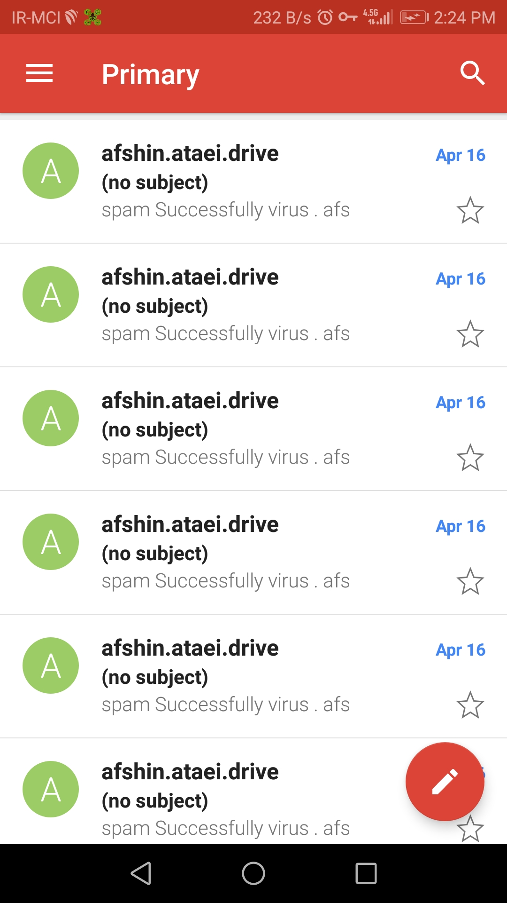

  <h1 align="center">😈Emailspam😈</h1>

  
  <a 

# How to use 

git clone https://github.com/afshinataei/Email.Bomber/

cd Email.Bomber

python3 Email-Bomb.py 

# Note 

Before running the tool go https://myaccount.google.com/security and turn on access applications with less security

# Photo 

# Contact us

Telegram : @IR_localhost
